# Clean Architecture 

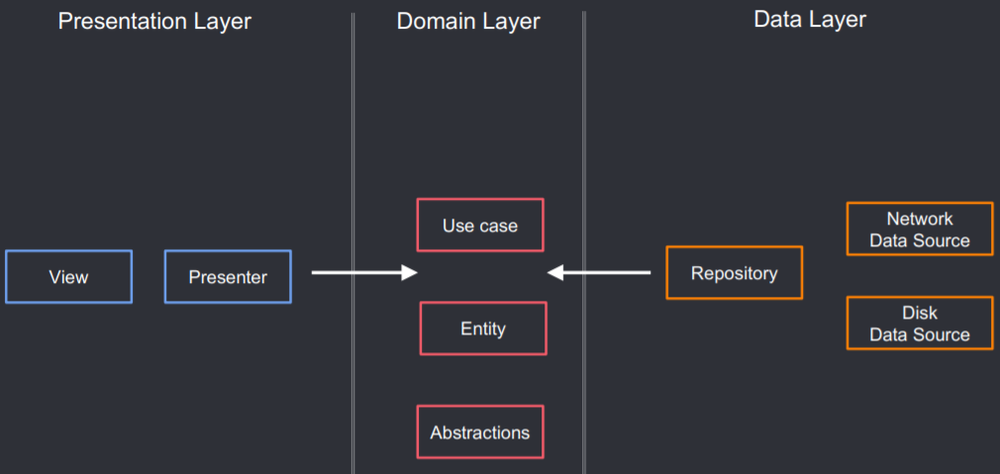

# Seção 1

## Comandos git
git config --global --edit

## Configuração git
[alias]

c = !git add --all && git commit -m

s = !git status -s

l = !git log --pretty=format:'%C(blue)%h%C(red)%d %C(white)%s - %C(cyan)%cn, %C(green)%cr'

t = !sh -c 'git tag -a $1 -m $1' -

amend = !git add --all && git commit --amend --no-edit

count = !git shortlog -s --grep

[push]

followTags = true

# Seção 2

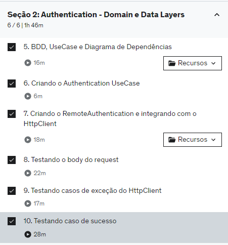

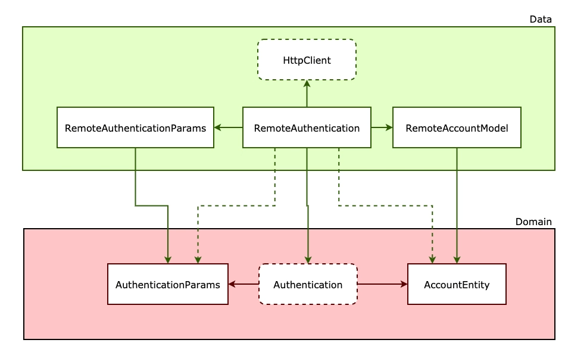

# Seção 3

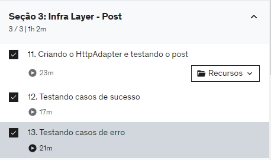

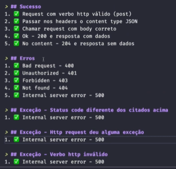

# Seção 4

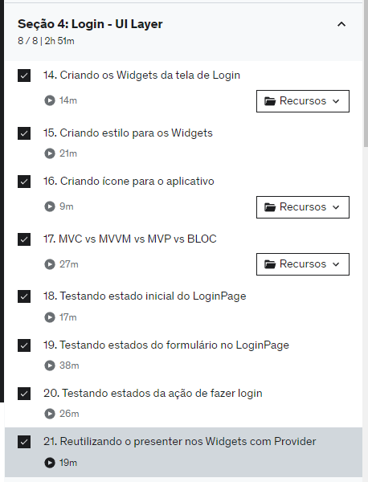

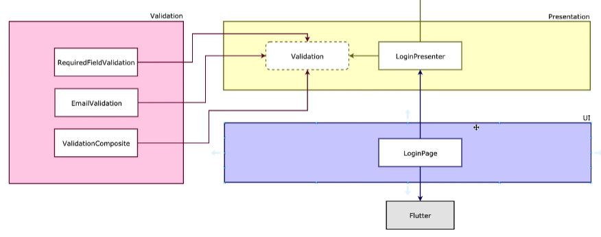

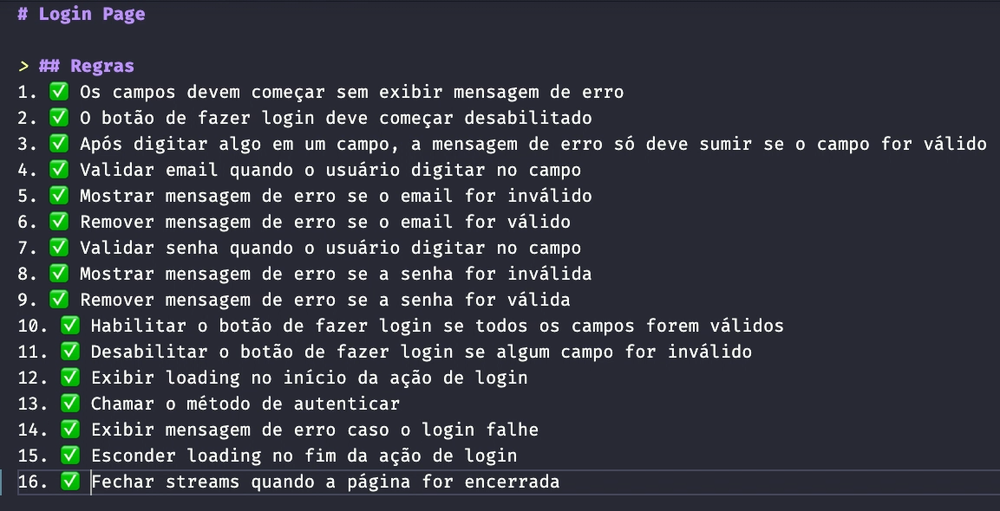

# Seção 5

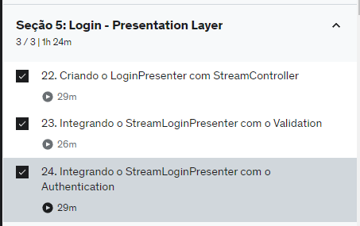

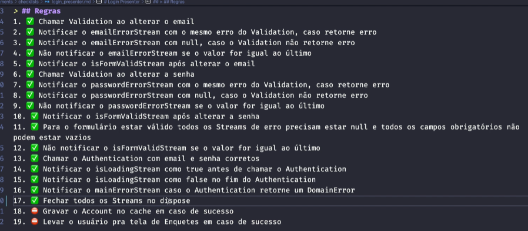

# Seção 5

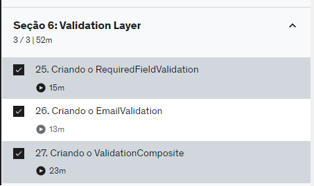

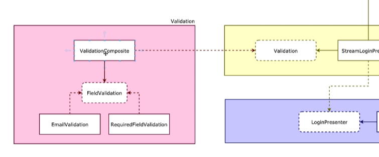

